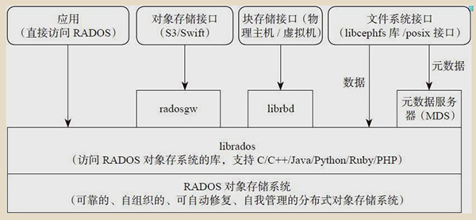
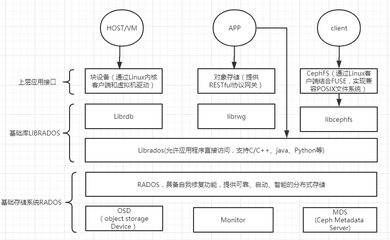
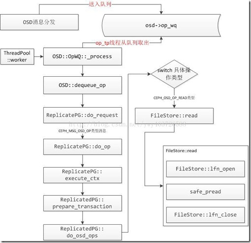
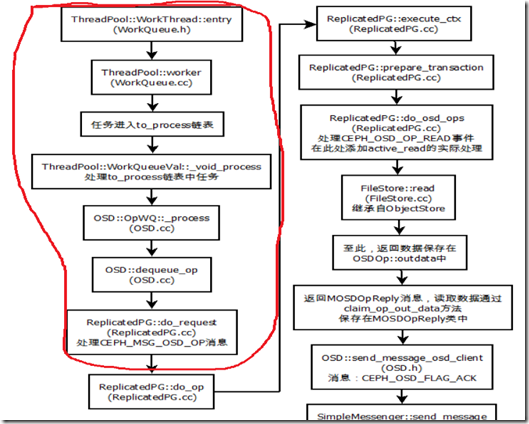

# Storage
Storage即存储系统，其中Ceph最近几年发展火热，也有很多案例落地企业。本文即是关于Ceph的粗略介绍。

参考的文章有：[Ceph论文](https://www.usenix.org/legacy/event/osdi06/tech/full_papers/weil/weil.pdf?tdsourcetag=s_pcqq_aiomsg)、[玩转 Ceph 的正确姿势](https://www.cnblogs.com/me115/p/6366374.html)、[Ceph基础知识和基础架构认识](https://www.cnblogs.com/luohaixian/p/8087591.html)、[让我们了解 Ceph 分布式存储](https://www.cnblogs.com/yangxiaoyi/p/7795274.html)、[Ceph源码解析：读写流程](https://www.cnblogs.com/chenxianpao/p/5572859.html)等等。

## Ceph
Ceph是一个分布式文件系统，它提供了优秀的性能、可靠性和可扩展性。

### 架构
Ceph 支持三种存储接口：对象存储 RGW(rados gateway)、块存储 RBD(rados block device) 和文件存储 CephFS。这三个接口只是在客户端的封装库不同，到服务端了都是对象存储。

#### 对象存储（RGW:RADOS gateway）
Ceph 对象存储服务提供了 REST 风格的 API ，它有与 Amazon S3 和 OpenStack Swift 兼容的接口。也就是通常意义的键值存储，其接口就是简单的GET、PUT、DEL和其他扩展;

#### 块存储（RBD：RADOS block device）
RBD 是通过librbd库对应用提供块存储，主要面向云平台的虚拟机提供虚拟磁盘；RBD类似传统的SAN存储，提供数据块级别的访问。

目前 RBD 提供了两个接口，一种是直接在用户态实现， 通过 QEMU Driver 供 KVM 虚拟机使用。 另一种是在操作系统内核态实现了一个内核模块。通过该模块可以把块设备映射给物理主机，由物理主机直接访问。

#### 文件存储
Ceph 文件系统服务提供了兼容 POSIX 的文件系统，可以直接挂载为用户空间文件系统。它跟传统的文件系统如Ext4是一个类型，区别在于分布式存储提供了并行化的能力；

#### 原生接口
除了以上3种存储接口， 还可以直接使用 librados 的原生接口，直接和RADOS通信；

原生接口的优点是是它直接和和应用代码集成，操作文件很方便；但它的问题是它不会主动为上传的数据分片；一个1G的大对象上传，落到 Ceph 的存储磁盘上就是1G的文件；

### 核心组件

#### Monitor
负责监视整个集群的运行状况，信息由维护集群成员的守护程序来提供，各节点之间的状态、集群配置信息。

#### OSD
由物理磁盘驱动器、在其之上的 Linux 文件系统以及 Ceph OSD 服务组成。Ceph OSD 将数据以对象的形式存储到集群中的每个节点的物理磁盘上，完成存储数据的工作绝大多数是由 OSD daemon 进程实现。

#### MDS
CephFS服务依赖的元数据服务。

#### Object
Ceph最底层的存储单元是Object对象，每个Object包含元数据和原始数据。

#### RADOS
Ceph存储集群的基础。在ceph中，所有数据都以对象的形式存储，并且无论什么数据类型，RADOS对象存储都将负责保存这些对象。RADOS层可以确保数据始终保持一致。

#### Librados
Librados是Rados提供库。上层的RBD、RGW和CephFS都是通过librados访问的。

#### PG
PG是一个逻辑概念，包含多个OSD。

#### RBD
Ceph对外提供的块设备服务。

#### RGW
Ceph对外提供的对象存储服务，接口与S3和Swift兼容。

#### CephFS
Ceph对外提供的文件系统服务。

### 特性

#### Crush
采用CRUSH算法，比起传统的集中式存储元数据寻址方案，数据分布均衡，并行度高。

####可用性和可靠性
动态分布式元数据。

副本数可以灵活控制。

支持故障域分隔，数据强一致性。

能够支持上千个存储节点的规模，支持TB到PB级的数据。

#### 可扩展性
去中心化，扩展灵活。

扩展随节点增长而线性增长。

#### 自动化
多种故障场景自动进行修复。

不存在单点故障，支持自动管理。

### IO流程及数据分布
#### Ceph读流程

1.客户端直接计算出存储数据所属于的主osd，直接给主osd上发送消息。

2.主osd收到消息后，可以调用Filestore直接读取处在底层文件系统中的主pg里面的内容然后返回给客户端。

#### Ceph写流程

1.首先客户端会将数据发送给主osd，

2.主osd同样要先进行写操作预处理，完成后它要发送写消息给其他的从osd，让他们对副本pg进行更改，

3.从osd通过FileJournal完成写操作到Journal中后发送消息告诉主osd说完成，进入5

4.当主osd收到所有的从osd完成写操作的消息后，会通过FileJournal完成自身的写操作到Journal中。完成后会通知客户端，已经完成了写操作。

5.主osd，从osd的线程开始工作调用Filestore将Journal中的数据写入到底层文件系统中。

### 数据分布

PG是指定存储池存储对象的目录有多少个，PGP是存储池PG的OSD分布组合个数

PG的增加会引起PG内的数据进行分裂，分裂相同的OSD上新生成的PG当中

PGP的增加会引起部分PG的分布进行变化，但是不会引起PG内对象的变动

pg和pool的关系：pool也是一个逻辑存储概念，我们创建存储池pool的时候，都需要指定pg和pgp的数量，逻辑上来说pg是属于某个存储池的，就有点像object是属于某个pg的。

## 评价
“Ceph的优势是Crush，劣势也是Crush。”
### 优点
- 高扩展性
- 高可用性
- 高可靠性
- 高自动化
- 特性丰富

### 缺点
- 系统复杂，不易优化
- 在小规模集群中， 会有一定的数据不均衡现象
