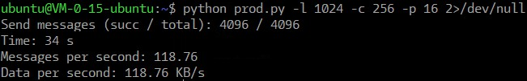
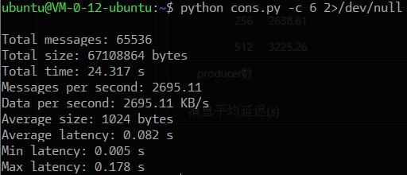
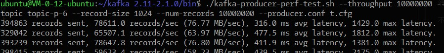

# Report of Experiment quantitative analyzing
|Author|Student ID|
|---|---|
|林义宣|515030910302|

## 实验目的

测试搭建好的Kafka集群作为消息队列使用的场景下，处理消息的能力。
主要指标有：

- 每秒传递消息数
- 每秒传递数据大小
- 消息从发送到被接收的延迟

## 实验步骤

1. 编写发送消息的上游程序，可以模拟多个Producer同时向Kafka集群发送消息，可以指定消息的数量和长度。程序的最后能输出统计信息，报告每秒发送的消息数
2. 编写接受消息的下游程序，可以模拟多个Consumer(不能多于topic设置的partition数)分工处理从Kafka集群获取的消息，可以从消息中的时间戳计算消息从发送到接受之间的延迟。程序的最后能输出统计信息，报告每秒接收的消息数，每秒接收的数据大小，以及消息延迟的时间
3. 在两台服务器上分别运行上游程序和下游程序，调整参数，收集它们输出的数据
4. 根据上一步的数据归纳总结

## 实验过程

考虑到一开始用于搭建Kafka集群的服务器性能太弱(1核1G)，难以模拟高并发的操作，于是临时增加两台新的更高配置的服务器(4核8G)来进行实验

Kafka API有多种语言的包装，为方便开发，我们采用了 python 及 [pykafka](https://github.com/Parsely/pykafka)

编写好[代码](code/README.md)之后，进行多次实验，每次实验先在一台服务器上运行`downstream.py`，再在另一台服务器上运行`upstream.py`

`downstream.py`设置consumer数量分别为1, 6, 12

`upstream.py`设置消息大小为1024Byte(这样 _每秒发送消息数_ 就等于 _每秒发送数据KB数_ )，消息数为256，producer数量分别为1, 4, 16, 64, 256, 512, 640

## 实验结果

上游程序输出例子

下游程序输出例子

### 每秒发送消息数

|producer数|每秒发送消息数|
| ---:|:--- |
| 1   | 9.48 |
| 4   | 33.55 |
| 16  | 136.88 |
| 64  | 533.31 |
| 256 | 2210.45 |
| 512 | 3629.71 |
| 640 | 3524.80 |

### 每秒传递消息数

|     |  1 | 6 | 12 | consumer数|
| ---:| --- | --- | --- | --- |
| 16  | 164.71 | 162.93 | 165.77 | |
| 64  | 638.82 | 648.23 | 652.71 | |
| 256 | 2638.61 | 2695.11 | 2691.57 | |
| 512 | 3225.26 | 4349.86| 4213.27| |
| 640 | 3116.97 | 3979.42 | 3958.69 | |
| producer数| | | | |

### 消息平均延迟(s)

|     |  1 | 6 | 12 | consumer数|
| ---:| --- | --- | --- | --- |
| 16  | 0.128 | 0.082 | 0.079 | |
| 64  | 0.131 | 0.083 | 0.081 | |
| 256 | 0.191 | 0.082 | 0.081 | |
| 512 | 8.056 | 0.097 | 0.092 | |
| 640 | 9.839 | 0.100 | 0.099 | |
| producer数| | | | |

## 分析与总结

通过观察**表1**，可以发现在producer数量不多时，每秒发送消息的数量和producer的数量成正比。
而随着增加producer数量，每秒发送消息的数量增长变缓最后还出现下降。

这是因为单个服务器的性能所限，上游程序采用多进程的方式并发发送消息，这样很快会将内存耗尽，出现频繁的交换，导致效率大幅下降。

在到达宿主机器的性能瓶颈之前，发送消息的行为，主要在等待Kafka集群的确认。这是IO型操作，只要Kafka集群还能承受的了就能通过平行部署上游程序提高发送消息的速率。但是由于没有足够的机器，用这次设计的方案无法测出Kafka集群的每秒发送消息数量的上限。

不过Kafka官方提供了一个Producer性能测试工具 `kafka-producer-perf-test.sh`，用它来测试可以得知我们所搭的Kafka集群每秒能够发送的消息数量在 七八万 左右：

通过观察**表2**，得知部署在这台虚拟机上的下游程序的单个Consumer每秒能接收的消息数大概为3200左右。结合**表3**，当producer们发送消息的数目超过consumer接收的速度的时候，消息会 _产生大量的延迟_ 。虽然Kafka所有消息可以持久化很长时间，但不处理的消息只会越堆越多，最后不可收拾。因此应根据发送的消息数量的增长，适当地增加一些同组的consumer来分流，共同处理大量的消息。

而在一般情况下，消息的延迟要小于100ms，消息的吞吐量也相当大，可见Kafka是非常高效的系统，更不用提还有各种优秀算法保证的可靠性了。
