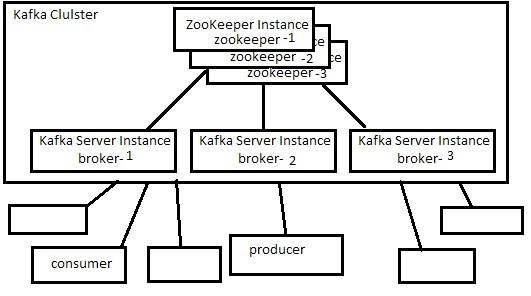

# Report of setting up Kafka
|Author|Student ID|
|---|---|
|沈小洲|5142609052|
|汪喆昊|516030910460|

## 准备

### 机器

CSE课程发了四台腾讯云的服务器，配置如下

Intel Xeon E5-2680 v4(2.4 GHz) 1核, 1GB RAM, 1.5Gbps内网带宽, 20万PPS收发包

于是考虑在腾讯云上布置一个Kafka集群。

### 软件环境

1. 配置云服务器时选择了 **Ubuntu 18.04 LTS 64bit** 的镜像
2. **JRE 1.8.0_191** [jre-8u191-linux-x64.tar.gz](https://download.oracle.com/otn-pub/java/jdk/8u191-b12/2787e4a523244c269598db4e85c51e0c/jre-8u191-linux-x64.tar.gz)
3. **ZooKeeper 3.4.12** [zookeeper-3.4.12.tar.gz](http://mirrors.hust.edu.cn/apache/zookeeper/stable/zookeeper-3.4.12.tar.gz)
4. **Kafka 2.11-2.1.0** [kafka_2.11-2.1.0.tgz](https://www.apache.org/dyn/closer.cgi?path=/kafka/2.1.0/kafka_2.11-2.1.0.tgz)

## 部署

### 架构设计



### 部署方案

将6个实例部署在三台服务器上，每台各部署一个 _zookeeper-x_ 和 _broker-x_

| 内网IP | 实例 |
| --- | --- |
| 172.17.0.7 | zookeeper-1, broker-1 |
| 172.17.0.8 | zookeeper-2, broker-2 |
| 172.17.0.9 | zookeeper-3, broker-3 |

### 目录结构

将下载到的JRE, ZooKeeper, Kafka压缩包解压到app目录下，并编写配置文件
创建runtime目录，用来存放程序数据

每台服务器有相同的目录结构
```
/home/ubuntu/                     # 腾讯云Ubuntu镜像默认用户的主目录
|- app/                           # 应用程序目录
|  |- jre1.8.0_191/
|  |  |- bin/
|  |  |  |- java                  # Java可执行程序
|  |  |- ...
|  |- zookeeper-3.4.12
|  |  |- conf/
|  |  |  |- zoo.cfg               # zookeeper启动配置文件
|  |  |  |- ...
|  |  |- ...
|  |- kafka_2.11-2.1.0/
|     |- bin/
|     |  |- kafka-server-start.sh # 官方提供的broker启动脚本
|     |  |- kafka-topics.sh       # 官方提供的topic管理脚本
|     |  |- ...
|     |- config/
|     |  |- kafka.cfg             # broker启动配置文件
|     |  |- ...
|     |- ...
|- runtime/                       # 应用程序运行时目录
   |- zookeeper/
   |  |- myid                     # zookeeper replica id
   |  |- version-2/               # zookeeper 数据存储目录
   |- kafka/
      |- logs/                    # Kafka日志系统存储目录
```

### 配置文件

**zoo.cfg**

```
tickTime=2000
dataDir=/home/ubuntu/runtime/zookeeper/  # 数据存储目录
clientPort=21800  # 服务端口
initLimit=5
syncLimit=2
server.1=172.17.0.7:21801:21802  # zookeeper-1的通信端口和选举端口
server.2=172.17.0.8:21801:21802  # zookeeper-2
server.3=172.17.0.9:21801:21802  # zookeeper-3
```

**kafka.cfg**

```
broker.id=1  # broker-2的配置文件此处改为2, broker-3同理
log.dirs=/home/ubuntu/runtime/kafka/logs  # 日志系统存储目录
# 服务监听地址和端口, 只为简单使用暂不配置安全协议
listeners=PLAINTEXT://172.17.0.7:21900  # broker-2改为.8, broker-3改为.9

# zookeeper replication 的地址端口
zookeeper.connect=172.17.0.7:21800,172.17.0.8:21800,172.17.0.9:21800
zookeeper.connetion.timeout.ms=6000

auto.create.topics.enable=false
num.partitions=3
min.insync.replicas=2
# 各类数据的复制因数都设置为3, 充分利用3台服务器
default.replication.factor=3
offsets.topic.replication.factor=3
transaction.state.log.replication.factor=3
transaction.state.log.min.isr=3

log.retention.hours=168
log.segment.bytes=1073741824
log.retention.check.interval.ms=300000

group.initial.rebalence.delay.ms=0
num.recovery.threads.per.data.dir=1
num.network.threads=3
num.io.threads=8
socket.send.buffer.bytes=102400
socket.receive.buffer.bytes=102400
socket.request.max.bytes=104857600
```

### 启动

首先启动三个 zookeeper 实例
在三台服务器上各执行一次

```
nohup $JAVA $CLASS_PATH $MAIN $CONF
```
其中 `$JAVA` 为 java 可执行程序路径，`$CLASS_PATH` 为 zookeeper 应用目录和其子目录，`$MAIN` 为 `org.apache.zookeeper.server.quorum.QuorumPeerMain` 即 zookeeper 服务器的主类，`$CONF` 为 zookeeper 配置文件 _zoo.cfg_ 的路径

之后再启动三个 broker 实例

```
nohup $KAFKA/bin/kafka-server-start.sh $CONF
```
其中 `KAFKA` 为 Kafka 应用目录，`$CONF` 为kafka配置文件 _kafka.cfg_的路径

最后六个实例会根据文档自动地组成一个Kafka集群
