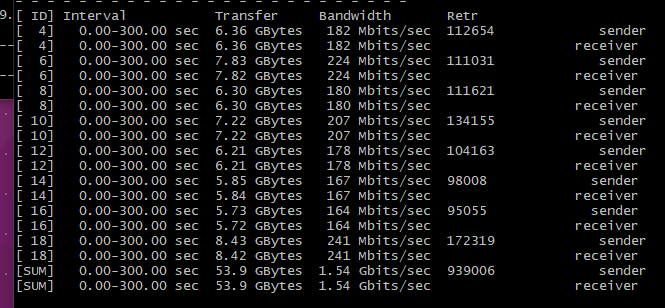
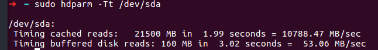

# Report of testing storage & network

- Author 汪喆昊
- Student ID 516030910460

这次作业里，沈小洲[部署](./report-of-setting-up-kafka.md)了 4 台服务器，服务器公网、
内网 ip 如下：

|         | 服务器 1   | 服务区 2   | 服务器 3   | 服务器 4    |
| ------- | ---------- | ---------- | ---------- | ----------- |
| 内网 ip | 172.17.0.7 | 172.17.0.8 | 172.17.0.9 | 172.17.0.10 |

服务器 1-3 上分别部署了 1 个 zookeeper 实例和 1 个 kafka broker 实例，剩下的一台部署
了 consumer，producer。

## Network

参考了[腾讯云的网络性能测试文档](https://cloud.tencent.com/document/product/213/11460)

首先安装 sysstat，Netpref，iperf3

```shell
$ sudo apt-get install sysstat iperf3
$ wget -c https://codeload.github.com/HewlettPackard/netperf/tar.gz/netperf-2.5.0
$ tar xf netperf-2.5.0 && cd netperf-netperf-2.5.0
$ ./configure && make && make install
```

### 带宽测试

首先需要一台陪练机向测试机发送信息
测试机

```shell
$ iperf3 -s
```

陪练机

```shell
$ iperf3 -c ${服务器IP地址} -b 2G -t 300 -P ${网卡队列数目}
```

例如

    $ iperf3 -c 10.0.0.1 -b 2G -t 300 -P 8

针对本次作业，使用 iperf3，从服务器 4 向服务器 1-3 发送数据，测量相应带宽。测试结果如下

|     |服务器 1|服务器 2|服务器 3|
| --- | ----- | ------ | ----- |
| 带宽 |1.54 Gbits/sec|1.54 Gbits/sec|1.54 Gbits/sec|
某次测试的证明



### UDP-STREAM 测试

文章里推荐使用一台被测试机器与八台陪练机器进行测试。假设其中 10.0.0.1 为测试机，10.0.0.2 到 10.0.0.9 作为陪练机。（本次作业未测试此项）

测试机

```shell
$ netserver
$ sar -n DEV 2
```

陪练机

```shell
$ ./netperf -H ${被测试机器内网IP地址} -l 300 -t UDP_STREAM -- -m 1 &
```

陪练机器理论上启动少量 netperf 实例即可（经验值上启动单个即可，如果系统性能不稳可以少量
新启动 netperf 加流），以达到 UDP_STREAM 极限值。

实例

    ./netperf -H 10.0.0.1 -l 300 -t UDP_STREAM -- -m 1 &

### TCP-RR 测试

将 UDP-STREAM 测试中的 UDP_STREAM 换成 TCP_RR 即可。陪练机器应该启动多个 netperf 实
（经验上值总 netperf 实例数至少需要 300 以上），以达到 TCP-RR 极限。（本次作业未测试此
项）

## Storage

首先了解两个伪设备

- /dev/null 伪设备，回收站.写该文件不会产生 IO
- /dev/zero 伪设备，会产生空字符流，对它不会产生 IO

可以使用如下命令测试硬盘写速度(表示 每次写入 8k 的数据，执行 300000 次)

```shell
$ time dd if=/dev/zero of=test.dbf bs=8k count=300000 oflag=direct
```

使用如下命令测试硬盘读速度(表示 每次读取 8k 的数据，执行 300000 次)

```shell
$ dd if=test.dbf bs=8k count=300000 of=/dev/null
```

也可以使用`hdparm`命令来测试

```shell
$ hdparm -Tt /dev/sda
```

测试结果如下

|                |服务器 1|服务器 2|服务器 3|
| -------------- | ----- | ------ | ----- |
| Cached Reads |10398.03 MB/sec|9627.82 MB/sec|10375.77 MB/sec|
| Buffered Reads |112.10 MB/sec|92.72 MB/sec|119.96 MB/sec|

某次测试的证明



以上。
