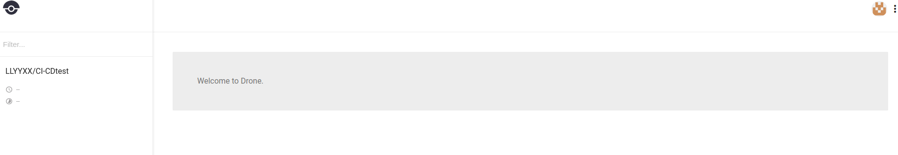
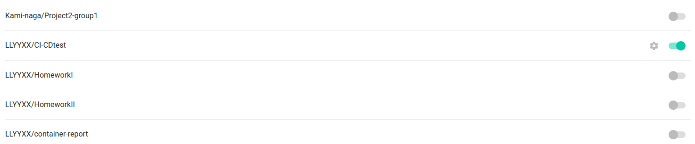
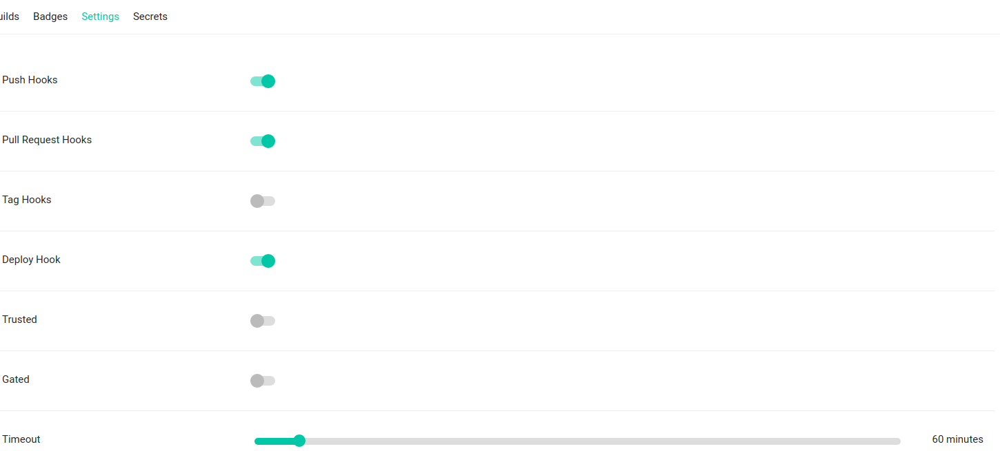
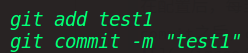

# Rquirement 1
林义宣 515030910302 F1603702

## 项目环境
- Ubuntu 16.04
- Docker 18.09
- drone 0.7

## 具体内容

- 采用drone搭建CI-CD平台
- 实现了每次git push后drone对该push的监测以及对应的操作

### 具体步骤
- 环境配置
- 开启drone监控
- 配置对应repo
- 配置.drone.yml文件

### 环境配置
关于Docker的安装可参见[如何在Ubuntu上安装使用Docker](https://cloud.tencent.com/developer/article/1167995)，Docker-Compose的安装参见[Docker 三剑客之 Docker Compose](https://cloud.tencent.com/developer/article/1101998).~~其实个人都是无脑apt-get的~~
Drone的配置具体可参见[如何在Ubuntu上安装Drone持续集成环境](https://cloud.tencent.com/developer/article/1180481)以及[drone安装](https://blog.csdn.net/qq_21816375/article/details/77202756)等等，其中配置文件需要根据个人需求调整。我的配置如下:

docker-compose.yml
'''
version: '2'

services:
  drone-server:
    image: drone/drone:0.7
    ports:
      - 80:8000
    volumes:
      - /var/lib/drone:/var/lib/drone/
    restart: always
    env_file:
      - ./server.env

  drone-agent:
    image: drone/drone:0.7
    command: agent
    restart: always
    depends_on:
      - drone-server
    volumes:
      - /var/run/docker.sock:/var/run/docker.sock
    environment:
      - DRONE_SERVER=ws://drone-server:8000/ws/broker
      - DRONE_SECRET=${DRONE_SECRET}
'''

server.env(其中Client_ID和Client_Secret是github上生成的)
'''
# Service settings
DRONE_SECRET=${DRONE_SECRET}
DRONE_HOST=${DRONE_HOST}
​
# Registration settings
DRONE_OPEN=true
​
# GitHub Settings
DRONE_GITHUB=true
DRONE_GITHUB_CLIENT={Client_ID_from_GitHub}
DRONE_GITHUB_SECRET={Client_Secret_from_GitHub}
'''


由于对服务器知识的了解出现偏差，在配置时浪费了大量时间。最后发现在OAuth应用程序的HomePageURL和callbackURL处都填写docker的本地IP即可成功运行。


### 开启drone监控
成功后，会显示对应的web界面，用github账号登录即可。


登录后，会显示该账号下的repo列表，可选择drone监控的repo。

如图所示即可开启drone对CI-CDtest的监控。


### 配置对应repo
修改drone内repo的设置，使得每次push/pull request/deployment等等操作时drone都会捕捉并进行应对。


### 配置.drone.yml文件
当drone监控到对应repo的某些操作时，会根据.drone.yml的内容进行对应操作。

drone引入了pipline的概念，整个build过程由多个stage组成，每一个stage都是docker。各stage间可以通过共享宿主机的磁盘目录, 实现build阶段的数据共享和缓存基础数据, 实现加速下次build的目标。各stage也可以共享宿主机的docker环境，实现共享宿主机的docker image, 不用每次build都重新拉取base image，减少build时间，可以并发运行。多个build可以并发运行，单机并发数量由服务器cpu数决定。

比如第一次尝试时进行的build部分的操作，应对操作为在命令行打出"start build...":

.drone.yml
```
workspace:
  base: /test
  path: src/github.com/LLYYXX/CI-CDtest
pipeline:
  build:
    image: maven:3.6.0-jdk-8-alpine
    commands:
      - echo "start build..."
```
在配置后，每当drone监控到该操作，都会在build的image下执行echo "start build..."操作。
commit之后，drone成功进行了应对。



#### 对web应用进行自动打包上传
这部分参考了[CI/CD初探(docker+drone)](https://www.jianshu.com/p/1e5f819f8881)和[Drone 中的概念：webhooks、workspace、cloning、pipelines、services、plugins、deployments](https://blog.csdn.net/kikajack/article/details/80503786)的一些内容。

通过进一步配置.drone.yml文件，可以实现Drone在监测到仓库行为后自动搭建并打包项目上传至DockerHub。
开启监控与Drone设置如上一部分所述。
在修改配置文件时，如果web应用的前端和后端部分需要在不同的镜像中安装必要的文件，build的阶段就要做对应修改。同时还需增加publish阶段来进行打包。
如对之前做的web前端进行配置如下

.drone.yml
```
workspace:
  base: /front
  path: src/github.com/LLYYXX/project1
pipeline:
  build:
    image: node:latest
    commands:
      - npm install
      - npm run-script build
  publish:
    image: plugins/docker
    repo: LLYYXX/project1
    tags: ["unfinished"]
    secrets: [ docker_username, docker_password ]
    dockerfile: Dockerfile
```
其中publish步骤使用到了plugins/docker插件, 这个插件是drone写的, 用于发布docker镜像. 它的作用就是构建一个镜像, 并push到registry。

后端需要根据需求增加配置指令等，这里~~因为之前没能成功写出后端~~不再赘述。

## 一些想法
Doker作为容器还是十分便利的，而Drone作为搭建CI-CD平台的工具相对来说也比较轻量级(Jenkins什么的较之则堪称重量级)，语法相对简洁。
然而即便如此我依然花了大量时间搭建环境，这让我发现前置知识的不到位必然会对后续学习产生不良影响。这次配置环境也进行了大量无用功，并且最终仍有一些问题没解决，也让我再一次感受到了知识的匮乏，十分难受。

另外，附上drone的[官方文档](https://docs.drone.io/installation/)以供参考。

