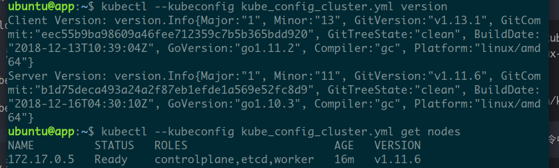

# Rquirement 2

汪喆昊 516030910460 F1603703

## 项目环境

- Tencent clout dual-core 4GB server
- Ubuntu 16.04
- Docker 17.03

根据同学的建议，使用RKE来搭建Kubernetes环境。由于有前辈的指导，整个过程中没有遇到太多问题。

## 步骤

### 1. 安装RKE

    wget https://github.com/rancher/rke/releases/download/v0.1.15/rke_linux-amd64
    mv rke_linux-amd64 rke
    chmod +x ./rke

### 2. 安装Docker

rke的文档中有提到，目前只支持docker17.03.2。安装时需要小心。可以使用rke文档中的命令直接安装。

    curl https://releases.rancher.com/install-docker/17.03.sh | sh

本项目要求可以在非root模式使用docker。为此需要执行下述命令，以设置正确的用户组。

    sudo groupadd docker
    sudo usermod -aG docker $USER

重新登录后运行下面的命令以查看是否正确配置。

    docker run hello-world

### 3. SSH相关配置

为确保可以ssh到本机，需要用`ssh-keygen`工具产生公钥，并复制到`~/.ssh/authorized_keys`中。

### 4. 配置RKE配置文件`cluster.yml`

    ./rke config --name cluster.yml

使用上面这条命令创建`cluster.yml`。我自己在创建的时候仅设置了ip地址、密钥位置，并且确保control panel、etcd选项为真。

### 5. 运行rke

    ./rke up

如果最后一行有`Finished building Kubernetes cluster successfully`的字样，集群就应该创建成功了。

### 6. 安装kubectl

    wget https://dl.k8s.io/v1.13.1/kubernetes-client-linux-amd64.tar.gz
    tar -zxvf kubernetes-client-linux-amd64.tar.gz
    cd kubernetes/client/bin
    chmod +x ./kubectl
    sudo mv ./kubectl /usr/local/bin/kubectl

为检查是否成功安装，运行下述命令。注意命令中的文件`kube_config_cluster.yml`应该在主目录中。

    kubectl --kubeconfig kube_config_cluster.yml version
    kubectl --kubeconfig kube_config_cluster.yml get nodes

下图是我的运行结果，仅供参考。

### 7. 创建dashboard

另外，感谢鄢新同学的帮助。没有他，这个项目估计是无法按时完成的。