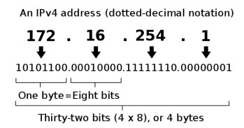
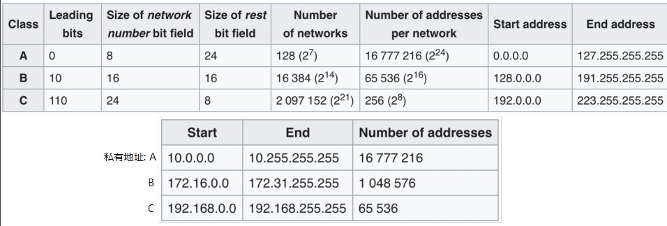

# Network

沈小洲 5142609052

## 网络模型

为了使不同的设备能够进行数据交换，必须制定一系列规则和标准。这类规则和标准被称为网络协议。
数据交换中途会经历不同的设备以及不同的层次，比如从应用到硬件，都需要有不同的协议支持。

1978年国际标准化组织(ISO)提出了OSI/RM (Open System Interconnection/Reference Model)，用以在更大的范围内建立计算机网络。

OSI/RM模型将计算机网络的通信协议划分成了七层，从下往上分别为：
- 物理层(Physics Layer)
- 数据链路层(Data Link Layer)
- 网络层(Network Layer)
- 传输层(Transport Layer)
- 会话层(Session Layer)
- 表示层(Presentation Layer)
- 应用层(Application Layer)。

除此之外常有TCP/IP五层协议以及TCP/IP四层协议，前者将标准模型上三层视为一层，后者更进一步将下两层视为一层。

### 物理层

物理层为上层协议提供传输数据的物理媒体，也就是说，物理层确保了**原始的数据**可以通过特定的**物理媒介**(铜线、光缆、无线电等)来传输到另一个设备。

物理层有众多的协议。工作在该层的常见的设备有集线器、放大器、串口等。

### 数据链路层

数据链路层基于物理层，将网络层的数据可靠地传输到相邻设备的网络层。
该层将数据按标准分块，控制数据在物理层上的传输，并进行物理地址寻址、流量控制、数据检错重发等工作。

数据链路层根据物理层的不同有各类网络接口协议。工作在该层的常见设备有网卡、网桥、交换机等。

### 网络层

网络层主要负责寻址、路由选择以及连接的建立保持与中止。该层对上层协议提供了透明的数据传输功能，屏蔽了网络硬件和链路细节；对下层协议提供了一致的数据结构(IP数据报)，屏蔽了各种不同的数据交换技术。

网络层主要的协议有
- **IP协议**
- ICMP协议
- ARP协议
- RARP协议
- ...

该层主要的设备有路由器

### 传输层

传输层基于网络层负责将上层协议的数据分段并按一定方式传输到另一个端口。另外也会提供差错控制流量控制等功能。

传输层的协议主要有**TCP协议**和UDP协议。工作在该层的设备主要是网关。

### 会话层

会话层负责主机间的会话管理(维护多次连接的状态)。通常合并入应用层之中(如HTTP协议服务端的Session管理)

### 表示层

表示层为达成一些目标对数据进行处理同时又确保通信双方能够理解这些数据，通常有加密、压缩、格式转换等处理。通常并入应用层之中而且可以比较容易的实现。

### 应用层

应用层为应用程序或操作系统提供访问网络服务的接口。

上三层常用的协议有FTP, DNS, SMTP, POP3, HTTP等(很多很多，以及可以根据业务实现私有协议)

## 硬件设备

基于OSI/RM模型，我们通常接触到的硬件设备交换机和路由器。

交换机工作在第二层数据链路层，基于设备的MAC地址，提供了端对端之间的数据帧的传输。

路由器工作在第三层网络层，基于IP协议中的IP地址，为数据传输提供寻址、路径选择等功能。
(现在一些路由器可以切换为交换机模式，一些路由器也提供了更高层的服务)

常用指标有
- 带宽，单位时间能够传输数据位数的硬件参数，单位bps(bit per second)
- 吞吐量，由于算法等因素通常性能达不到带宽，吞吐量为实际最大的单位时间数据传输量
- 包转发率，单位时间转发的数据包的数量，单位为pps(packet per second)
- 延迟
- ...

至于我们平日所用的计算机，网卡负责前两层(主要有基于MAC的寻址和物理媒介的数据传输)的工作，系统软件处理第三层(主要有基于IP协议的寻址路由和收发数据报)第四层(主要有基于TCP/UDP协议的数据报收发)的工作，而我们使用的应用软件或者开发的软件通常完成第五六七层的工作(基于HTTP，DNS等应用层协议提供或使用服务)

## IPv4地址

IPv4地址(后称IP地址)的格式为32bit，十进制时表示为每8位一段，用点隔开。
例如

### 分类

IP地址由网络号和主机号组成，根据不同网络的规模，被分为五大类，D类为组播地址E类为保留地址，主要使用的ABC类如下图所示

A类地址以0开头，有8位的网络地址(除去固定0开头为实际7位)，24位的主机地址，能表示128个网络，每个网络可以分配16777216个地址。

B类地址以10开头，有16位的网络地址(14位)，16位的主机地址，能表示16384个网络，每个网络可以分配65536个地址

C类地址以110开头，有24位的网络地址(21位)，8位的主机地址，能表示2097152个网络，每个网络可以分配256个地址

其中各类都有部分网络作为私有地址，不在全球范围使用。私有地址可以任意使用，不需要向IP管理机构申请，但脱离了内网环境就失去意义。私有地址可由NAT(Network Address Translation)网络地址转换技术转换为一个公网IP地址与互联网中其他主机通信。

### 子网

根据上述分类方式，只提供了三种容量的网络，为了应对不同组织不同的网络划分需求，通过从主机号划分出子网号来根据需求组建不同容量的子网。这样IP地址就由网络号+子网号+主机号组成。

由于IP地址本身不提供子网的信息，需要提出**子网掩码**的概念，子网掩码和IP地址成对出现，用以说明该ip地址中哪几位表示子网号。子网掩码由连续的1紧接着连续的0组成，共32位与IP地址相同，连续的0表示主机号所在的位，根据IP地址起始位判断是ABC中的某一类，进而判断出网络号的位，网络号与主机号之间便是子网号的位。
例如

### 特殊地址

每个子网的第一个地址即主机号为0...0，作为子网标识符，最后一个地址即主机号为1...1，作为该子网的广播地址。向一个子网的广播地址发送数据，会发送至该子网中所有的主机。

127.0.0.0~127.255.255.255为本地回环地址，所有向这些IP发送的数据都只会在本机处理。

## 总结

计算机网络层次结构很好地将主机间通信的不同阶段隔离开来。
特别是中间网络层/传输层的TCP/IP协议，对上层提供了透明且直观的数据传输模型(ip地址+数据报)，提供了可靠的数据传输功能，又隐藏了细节；对底层也是同样，底层协议不需要再考虑应用协议的内容。

基于合理划分的层次结构，以及其中经过长年发展已经稳定高效的底层，计算机网络发展非常迅速，各类新兴应用层出不穷，使得网络已经如空气一般融入了大家的生活。

当然目前的网络依然不是完美的，例如IPv4的地址耗尽问题，网络传输的速率与延迟依然不稳定，基于网络的服务不是一直可靠等等。但是现在仍有许多的开发者和工程师们致力于解决网络中的种种问题，致力于改善网络支持更多的功能，可以想象网络会变得更好。
