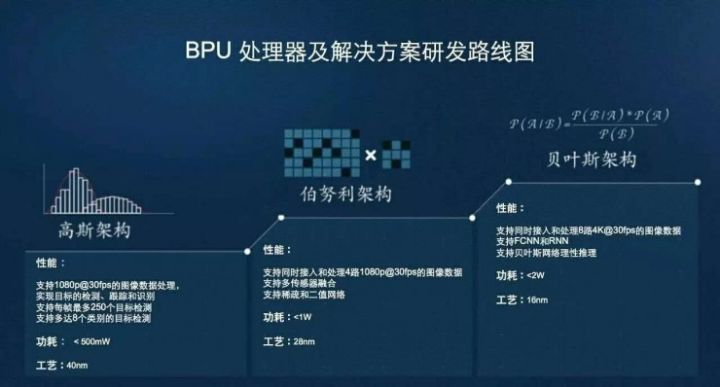

# xPU
xPU泛指一系列名称以英文字母开头芯片。各家芯片公司为了打响自己产品的名号，常常选一个别人
还没用过的英文字母再加上“PU”来命名自己的产品。下面大致介绍一下各种PU的特点、优缺点等信
息。本文参考的文章有
[零基础看懂全球AI芯片：详解“xPU”](https://zhuanlan.zhihu.com/p/28325678)

## APU
### Accelerated Processing Unit
是AMD的一个处理器种类。通过在一颗芯片上集成传统CPU和图形处理器GPU，就可以不需要北桥，灵
活地在CPU和GPU间分配任务。AMD将这种异构的处理器称为加速处理单元，APU。APU可以代替入门
级显卡，对于需要轻量图形运算的人群来说性价比较高，有不小的优势。缺点是内存，由于CPU、GP
U共用一块内存，会引起一系列问题。
### Audio Processing Unit
声音处理器，即处理声音数据专用的处理器。（这没啥好说的）
## BPU
### Brain Processing Unit
[地平线机器人公司](http://www.horizon.ai)的AI芯片。地平线是一家成立于2015年的
start-up，总部在北京，目标是“嵌入式人工智能全球领导者”。相比于国内外其他AI芯片start-up
公司，地平线的第一代BPU走的相对保守的TSMC的40nm工艺。

BPU相对其他用于人工智能的xPU来说功耗、成本更低，同时由于专门针对特定应用场景（自动驾
驶、摄像头）来开发，针对性更好。缺点网上没有找到。（既然是中国的芯片产品，恐怕工艺水平就
不大高了）
### Biological Processing Unit
生物计算机。这个就当没看见吧。
### Bio-Recognition Processing Unit
生物特征识别处理器。这个也没啥好说的。

## CPU
CPU主要工作是调度，在机器学习所需要的运算模式下优势不大，但这不意味着没有公司在使用CPU
进行人工智能方面的工作。由于没有

## DPU

## EPU

## FPU

## GPU

## HPU

## IPU

## KPU

## MPU

## NPU

## OPU

## PPU

## QPU

## RPU

## SPU

## TPU

## UPU

## VPU

## WPU

## XPU

## ZPU

## Others
